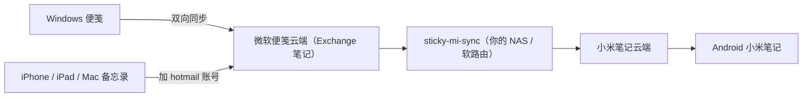

# sticky-mi-sync

**让 Windows / iPhone / iPad / Mac / 小米手机，各自用系统自带的笔记 App，
同步同一份文本笔记 —— 全程不装任何第三方 App。**


---

## 它解决的是什么问题

你手上大概率同时有这几类设备，而它们**各自都自带笔记 App**：

| 设备 | 系统自带的笔记 App |
|---|---|
| **Windows** | **便笺**（Sticky Notes） |
| **iPhone / iPad / Mac** | **备忘录**（Notes） |
| **小米手机** | **小米笔记** |

三个 App 各自都好用，**但它们之间互不相通** —— 你在电脑上记的东西，手机上根本看不到。

这个项目把断掉的路接上，而且做到**全程不装 App**。

### Apple 端：零配置，加个账号就行

在 iPhone / iPad / Mac 的**「备忘录」**里加一次 hotmail 账号：

> **设置 → 备忘录 → 账户 → 添加账户 → Outlook.com**

苹果系统**原生支持 Exchange 备忘录**，而微软便笺的数据就在这同一个 Exchange 账户里。
加完之后，**备忘录里会直接出现那份便笺，两边改哪边都同步** ——
不装任何 App，也**不需要这个服务参与**。

### Android 端：这个服务补的就是这一环

安卓上系统自带的是**小米笔记**，但它和微软便笺之间**没有官方通道**。

所以这个服务跑在**你自己的 NAS / 软路由**上，把「小米笔记」和「微软便笺」**双向打通** ——
你在小米笔记里写的会出现在便笺里，反过来也一样。

### 连起来是这样



**于是三端全部连上**：在哪台设备上随手记一笔，**其它设备上都能看到**。

> **图中箭头只表示走向，实际每一段都是双向的。** 三段关系分别是：
> ① Windows 便笺 ⇄ 微软云端（便笺 App 自己就在同步）；
> ② Apple 备忘录 ⇄ 微软云端（加一次 hotmail 账号即可，**本服务不参与**）；
> ③ 微软云端 ⇄ 小米云端（**由本服务双向桥接**）。
>
> 图用 Mermaid 画（GitHub 直接渲染）。这里刻意**只用最基础的 `-->` 语法** ——
> 双向箭头 `<-->` 在 GitHub 的 Mermaid 版本上会报 `Unable to render rich display`。
> 每行一条语句、节点标签不用 HTML、边标签不加引号，是兼容性最好的写法。
>
> 早先这里是纯字符拼的 ASCII 图，**中西文混排宽度不一致**，经常对不齐 ——
> 换成 Mermaid 后由渲染器自己排版，不会再歪。

### 为什么值得这么做

- **一个 App 都不用装** —— 四类设备，全用系统自带的
- **数据攥在自己手里** —— 中间那段（小米 ⇄ 微软）跑在你自己的机器上，不经过第三方
- **符合直觉** —— 打开手机的「小米笔记」、Windows 的「便笺」、Mac 的「备忘录」，看到的是同一份内容

**特性**：

- **双向同步**，不是单向推送 —— 在哪边改都行
- **删了能捞回来** —— 两侧删除都会先存进回收站
- **冲突不丢数据** —— 两边同时改时保留双方（可选"以最后修改为准"）
- **容器里能长期跑** —— 不需要浏览器，凭据自动续期
- **有自己的访问密码** —— 防止同网段的人随便翻你的笔记

---

## 快速开始（Docker）

**这是推荐方式**，也是这个项目的主要目标环境（NAS / 软路由 / 树莓派都行）。

```bash
git clone https://github.com/dxfong/sticky-mi-sync.git
cd sticky-mi-sync
docker compose up -d --build
```

**然后在浏览器打开 `http://<你的设备IP>:8787`。**

> 启动日志里会直接打印局域网地址，照着用就行。
> 默认监听 `0.0.0.0`（局域网可访问）。想只允许本机，设 `SMS_HOST=127.0.0.1`。

<details>
<summary><b>国内网络：构建卡住怎么办</b></summary>

```bash
# 卡在 pypi.org 超时
PIP_INDEX=https://pypi.tuna.tsinghua.edu.cn/simple docker compose up -d --build
```

卡在拉 `python:3.13-slim` 的话，给 Docker 配镜像加速
（iStoreOS 一般在「Docker → 镜像加速」里配）。

</details>

<details>
<summary><b>容器能上国内网、上不了国外网</b>（Docker bridge 的老问题）</summary>

症状：容器里 `i.mi.com` 通，但 `*.microsoft.com` 全部超时，而宿主机直连正常。

建一个 `docker-compose.override.yml`（**不用改仓库文件**）：

```yaml
services:
  sticky-mi-sync:
    network_mode: host
    ports: !reset []
```

</details>

---

## 先配 Apple 端（可选，但强烈建议）

**这一步不用这个服务，纯粹是苹果系统自带的能力**，1 分钟搞定：

1. iPhone / iPad / Mac 打开 **设置 → 备忘录 → 账户 → 添加账户**
2. 选 **Outlook.com**（或 Microsoft Exchange），用你的微软账号登录
3. 打开「备忘录」App —— 便笺已经在里面了

配完之后，**Apple 设备这一端就完全通了**，改哪边都会同步。

> 不配也能用，只是 Apple 设备上得靠浏览器开 Outlook 网页版看，体验差很多。

---

## 首次使用

部署后是**全新的初始化状态**（镜像里不含任何凭据，需要你现场登录一次）。
按顺序做五件事：

### 1. 设置访问密码

打开页面会提示「第一次使用，先给这个服务设一个访问密码」→ 设一个 ≥8 位的。

**这是防止同网段的人随便打开你的页面读笔记正文。**

### 2. 登录小米笔记

页面顶部 **「账号与登录」** → 展开 → 小米卡片**最上方**就是账号密码登录：
输小米账号密码 → 可能弹图形验证码 → 选短信或邮箱收二次验证码 → 完成。

**全程在本页面完成，不需要浏览器。**

> ⚠️ **别用「扫码登录」**。扫码 = 新设备 → 小米会要求交互式安全验证，
> 这条链路处理不了，会一直卡住。同理「浏览器登录」需要桌面环境，容器里用不了。
>
> 小米对**新设备 / 异地登录**要求二次验证是**它自己的风控**，不是本程序的问题。
> 用账号密码走的是正常登录流程，能通过。

**登录后拿到 `passToken`，之后自动续期，不用再登。**

### 3. 选择要同步的文件夹

小米卡片里点开文件夹下拉框，选中目标文件夹（例如「便笺」）。

### 4. 登录微软便笺

**这是唯一需要提前准备的一步** —— 去 Azure 注册一个应用。
**免费、2 分钟、不用信用卡。**

1. 打开 [Azure 门户 → 应用注册](https://portal.azure.com/#view/Microsoft_AAD_RegisteredApps/ApplicationsListBlade)，
   用**同一个微软账号**登录
2. **新注册** → 名称随便填 → **受支持的账户类型**选含「**个人 Microsoft 账户**」的那项
3. **重定向 URI 留空**（设备码流程不需要）→ 注册
4. 左侧 **身份验证** → **允许公共客户端流** 设为「**是**」
5. 左侧 **API 权限** → 添加权限 → **Microsoft Graph** → **委托的权限** →
   搜 `Notes` → 勾 **`Notes.ReadWrite`** → 添加
6. 回 **概述** 复制 **应用程序(客户端) ID** → 粘到页面 → 保存
7. 点 **开始设备码登录** → 页面给一个码 → 打开 [microsoft.com/link](https://www.microsoft.com/link)
   输码授权

> ⚠️ 第 5 步是 **`Notes.ReadWrite`**，**不是** `ShortNotes.ReadWrite`。
> 便笺真正的接口是 **Outlook REST**，它认前者；ShortNotes 那个端点
> **对个人微软账号根本不存在**（实测 400）。

**授权一次之后 token 自动续期，不用再管。**

### 5. 开启自动同步

顶部最右侧的 **「自动同步」** 按钮点一下。

> 打开后列表会自动刷新。想先看看它会做什么，可以先用「只读拉取两端列表」。

---

## 你的数据安全吗

**先看三层密码的分工**（它们互相独立）：

| 层 | 管什么 | 忘了怎么办 |
|---|---|---|
| **访问密码** | 谁能打开这个页面 | 命令行清掉重设（见下方文档） |
| **微软登录** | 连谁的便笺 | 重新走一次设备码授权 |
| **小米登录** | 连谁的笔记 | 重新用账号密码登录 |

**部署后第一件事建议先读：[`docs/LOGIN-AND-LIMITS.md`](docs/LOGIN-AND-LIMITS.md)** ——
里面写清了两侧登录方式、凭据怎么续期、**什么情况下才需要重新登录**，
以及几条实测出来的平台限制（可以省掉不少"为什么这里怪怪的"）。

---

## 常见问题

**页面打不开 / 点登录报 `Failed to fetch`**
后端没连上。确认容器在跑，并且你是从 `http://<IP>:8787` 打开的
（不要直接双击 `index.html`）。页面顶部会显示「页面来源」和「已尝试的地址」，照着看。

**Apple 的备忘录里没有出现便笺**
先确认账户加对了（**设置 → 备忘录**里要能看到那个账户，并在「备忘录」App 里勾选它）。
另外 Exchange 备忘录**只同步文本** —— 手写、图片、附件这类不会过去。

**容器健康检查是 `unhealthy`**
`docker compose logs` 看日志。若日志显示 `/api/auth/status` 正常返回，
多半是端口映射写错了。

**小米卡片里看不到文件夹**
首次拉取要翻页才能拿到文件夹列表（接口只在最后一页返回）。
点一次「只读拉取两端列表」即可。

**同步为什么这么慢 / 为什么一批一批地写**
小米有**风控**（请求到达速率过快会被限流）。所以做了写入限速 + 单轮上限 + 配额冷却。
首次全量同步会摊成好几轮，是正常现象，不是卡住。

**开了自动同步，为什么会自己暂停**
连续失败 3 轮会自动暂停（避免一直撞墙）。看日志里的失败原因。

**同步时提示"已拦截本轮"**
一侧被清空（或在另一台设备上大量删除）时，会把上百条映射解读成"用户删了"，
进而**反过来删另一端**（会同步到云端，真丢数据）。
所以单轮删除量超过阈值就拦下整轮。确认是你要的操作，可以在设置里放宽或强制。

**小米凭据会不会过期、要不要定期重登**
**正常情况下不需要。** `serviceToken` 会过期（几小时~几天），
但程序会用 `passToken` **自动换新**（实测约 3 秒，你感觉不到）。
只有 `passToken` 本身失效（比如你在小米侧点了"退出所有设备"）才需要重登。

**日志里出现「小米凭据正在续期中（本轮先跳过）」**
**这不是故障** —— 说明同一时刻有另一条路径在换证，等下一轮即可。

---

## 更多文档

| 文档 | 内容 |
|---|---|
| [`docs/LOGIN-AND-LIMITS.md`](docs/LOGIN-AND-LIMITS.md) | **两侧登录方式详解** + 凭据续期 + 实测平台限制 |
| [`docs/ENV-AND-DATA.md`](docs/ENV-AND-DATA.md) | 环境变量 / 数据目录 / 备份 / 忘记密码 / 网络受限环境 |
| [`DOCKER-READINESS.md`](DOCKER-READINESS.md) | 发布前的容器可用性检查清单 |
| [`RELEASE-CHECKLIST.md`](RELEASE-CHECKLIST.md) | 发版流程 |

---

## 开发

```
server.py            HTTP 服务 + JSON API + 后台同步线程
web/index.html       单文件前端（vanilla JS）
notesync/
  engine.py          三方比较 + 四方决策（同步核心）
  store.py           SQLite：映射表 / 基线 / 凭据 / 日志 / 回收站
  graph.py           微软便笺（Outlook REST）
  notesfabric.py     NotesFabric 协议（备用通道，容器里不推荐）
  xiaomi.py          小米笔记
  auth.py            访问密码 + 会话
  textutil.py        文本规范化
devtools/
  smoke_test.py      接口冒烟测试
  browser_walk.py    浏览器走查（含断言）
  check_js.py        前端内联 JS 语法检查
  _mermaid_check.py  把 README 里的 Mermaid 图真渲染一遍（改图后跑）
```

跑测试：

```bash
python devtools/check_js.py                        # 前端语法
python devtools/smoke_test.py --port 9000          # 接口冒烟（23 项）
python devtools/browser_walk.py --base http://127.0.0.1:9000   # 浏览器走查（41 项）
```

### 设计上的几个要点（给改代码的人）

- **判"内容变了没有"只能比内容哈希，绝不用时间戳** ——
  时间戳会被同步动作本身刷新，用它会导致每轮都误判"对方改了"。
- **两侧时间戳的语义不一样，不能直接混用** ——
  微软云端不接受客户端指定时间（补建的记录时间必然是"补建那一刻"），
  所以排序时要区分"内容原本的时间"和"云端记录的时间"。详见平台限制文档。
- **删除传播必须双向都有安全阀** —— 理由见上面的常见问题。
- **写入要限速** —— 同上。
- **改了会话 / cookie 的语义，必须同时决定"存量怎么办"** ——
  否则新规则对老登录态形同虚设（踩过）。
- **拉列表遇网络抖动要重试** —— 微软侧链路实测抖动剧烈，
  `URLError: SSL UNEXPECTED_EOF` 一小时能出现 7 次，全断在拉列表这一步。

---

## License

MIT
