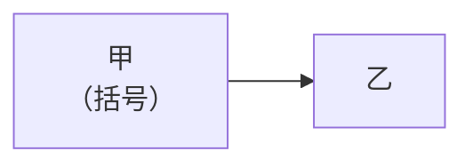
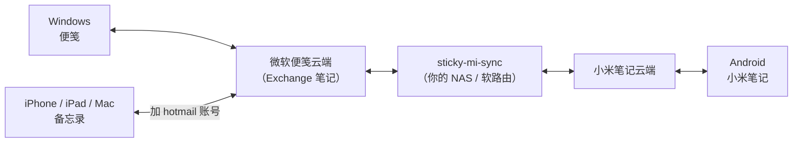
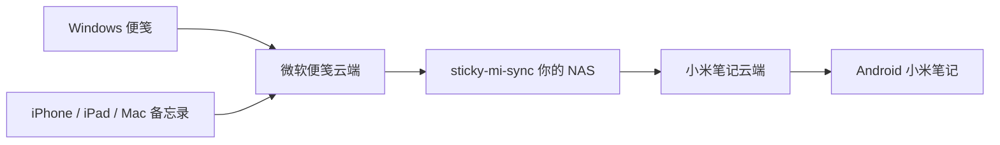

# Mermaid 兼容性探针（临时文件，验证完会删）

目的是找出 **GitHub 端**能渲染、而本地也一致的写法。

## 1 双向箭头 + 带引号边标签

## 2 双向箭头 无标签

## 3 单向箭头 + 无引号边标签

## 4 无箭头连线

## 5 br 换行 + 中文括号

## 6 完整当前图（README 里那段）

## 7 保守版：节点先声明 + 无引号标签 + 少用双向

## 8 完全不用双向箭头（最保守）

